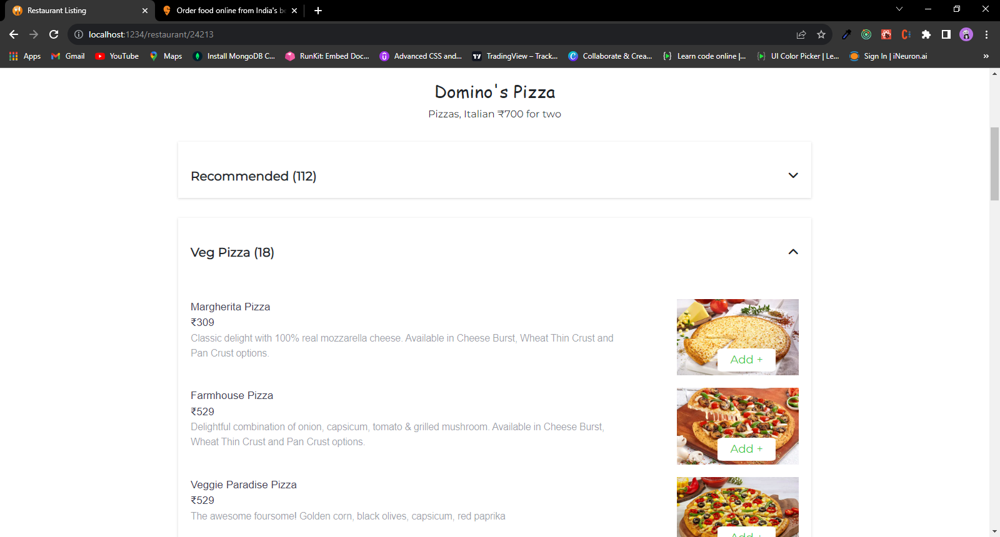

# Restaurant Listing Application

# [Preview](https://restaurant-listings.vercel.app/)

## To start with this application

#### Please Run Command in your local git clone with link of this repo.

#### Then Go into the project where you have these file with simply cd directory-Name

#### npm run start

#### and you will get a copy of this project on your port 1234. Simply type this and hit enter http://localhost:1234

# Some Visuals of Application

